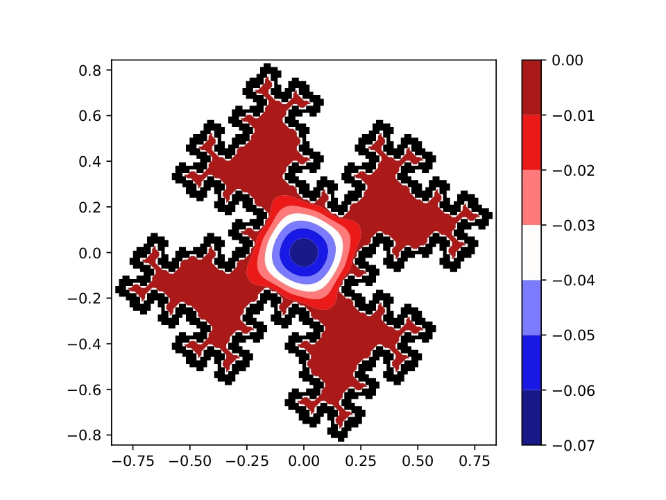
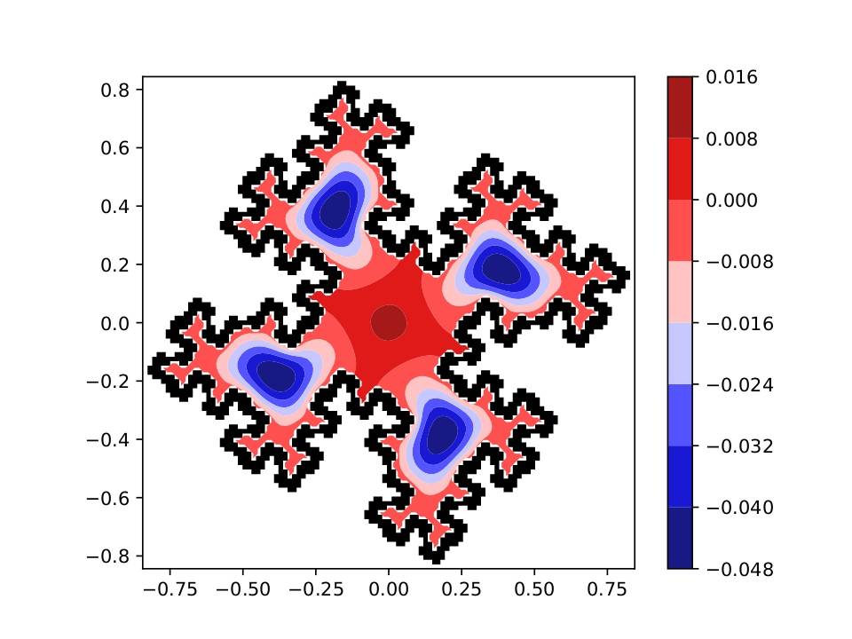

# Fractal drum

This project was given as an exercise in TFY4235 [Computational Physics](https://www.ntnu.edu/studies/courses/TFY4235#tab=omEmnet) at [NTNU](https://www.ntnu.edu/) spring 2022.

**Project description**: Reproduce experimental results obtained by [Sapoval et al.](https://journals.aps.org/prl/abstract/10.1103/PhysRevLett.67.2974) by solving the [Helmholtz equation](https://en.wikipedia.org/wiki/Helmholtz_equation) and the [biharmonic eigenvalue](https://en.wikipedia.org/wiki/Vibration_of_plates) problem on top of a [Koch fractal](https://en.wikipedia.org/wiki/Koch_snowflake).

## Examples: Helmholtz first and fifth eigenmode

